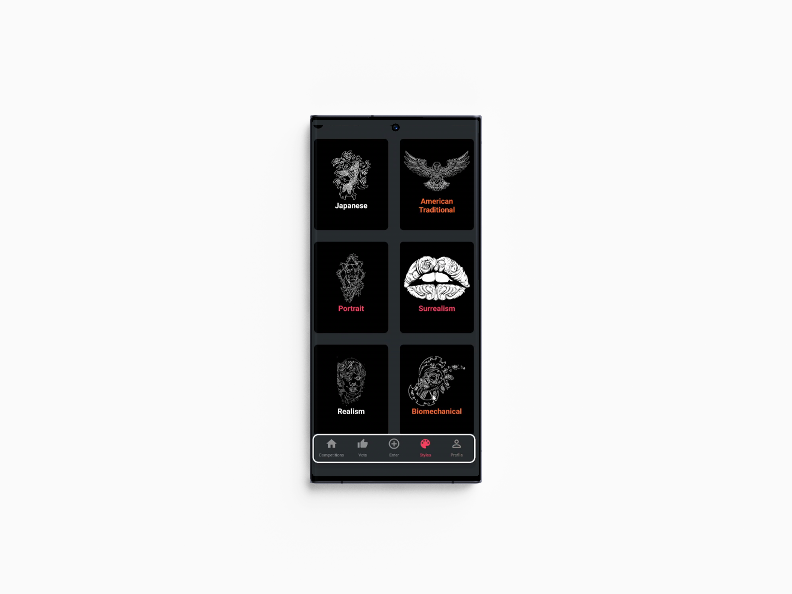

<!-- Repository Information & Links-->
<br />


<!-- LeandervanAarde/FikaClothing -->

<!-- HEADER SECTION -->
<h3 align="center" style="padding:0;margin:0;">Leander van Aarde</h3>
<h5 align="center" style="padding:0;margin:0;">200211</h5>
<h6 align="center">Stencil | 2023</h6>
</br>
<p align="center">

  <a href="https://github.com/LeandervanAarde/stencil">
    
  </a>
<!-- https://drive.google.com/file/d/19JkfDgvGLzHQ1AVMvgv9rLTFR0HzJBVq/view?usp=sharing -->
  
  <h3 align="center">Stencil | Tattoo competition Application</h3>

  <p align="center">
    Stencil is a competition app for Tattoo enthusiats and Artists who share a passion in art
    <br />
   <br />
   <br />
   <!-- INSERT UP UP -->
    ·
    <a href="https://github.com/LeandervanAarde/stencil/issues">Report Bug</a>
    ·
    <a href="https://github.com/LeandervanAarde/stencil/issues">Request Feature</a>
</p>
<!-- TABLE OF CONTENTS -->

## Table of Contents

* :skull:  [About the Project](#about-the-project)
* :skull:  [Project Description](#project-description)
* :skull:  [Built With](#built-with)
* :skull:  [Getting Started](#getting-started)
* :skull:  [Prerequisites](#prerequisites)
* :skull:  [How to install](#how-to-install)
* :skull:  [Features and Functionality](#features-and-functionality)
* :skull:  [Concept Process](#concept-process)
* :skull:  [Development Process](#development-process)
* :skull:  [Highlights](#highlights)
* :skull:  [Challenges](#challenges)
* :skull:  [Future Implementation](#peer-reviews)
* :skull:  [Final Outcome](#final-outcome)
* :skull:  [Mockups](#mockups)
* :skull:  [Video Demonstration](#video-demonstration)
* :skull:  [Conclusion](#conclusion)
* :skull:  [License](#license)
* :skull:  [Contact](#contact)
* :skull:  [Acknowledgements](#acknowledgements)

<!--PROJECT DESCRIPTION-->
## About the Project
<!-- header image of project -->


### Project Description
Stencil is a cross-platform mobile application that allows tattoo enthusiats and tattoo artist to connect through art, giving everyone the opportunity to enter and vote on competitions related to different tattoo styles

### Built With
* [ReactNative](https://reactnative.dev/)
* [Expo](https://expo.dev/)
* [Firebase](https://firebase.google.com/)

## Getting Started

To get a copied file of this repository, follow the steps below to get it installed on your local machine. 

### Prerequisites

To clone and run this application, you'll need [Git](https://git-scm.com) and [Node.js](https://nodejs.org/en/download/) (which comes with [npm](http://npmjs.com)) installed on your computer. From your command line:

## Getting Started

To get a copied file of this repository, follow the steps below to get it installed on your local machine. 

### Prerequisites

Ensure that you have the latest version of [NPM](https://www.npmjs.com/) installed on your machine. The [GitHub Desktop](https://desktop.github.com/) program will also be required.
Ensure that you have the Expo CLI installed on your local machine, you an install it by running the command  `npm install -g expo-cli`

### How to install

### Installation
Here are a couple of ways to clone this repo:


1. GitHub Desktop </br>
Enter `https://github.com/LeandervanAarde/stencil.git` into the URL field and press the `Clone` button.

2. Clone Repository </br>
Run the following in the command-line to clone the project:
   ```sh
   git clone https://github.com/LeandervanAarde/stencil.git
   ```
    Open `Software` and select `File | Open...` from the menu. Select cloned directory and press `Open` button
3. Install Dependencies </br>
Run the following in the command-line to install all the required dependencies:
   ```sh
   npm install / npm i
   ```
5. Once in the App, run  ```npm start``` to compile in the Expo go app or emulator.

</br>
 </br>

<!-- FEATURES AND FUNCTIONALITY-->
<!-- You can add the links to all of your imagery at the bottom of the file as references -->
## Features and Functionality

<!-- note how you can use your gitHub link. Just make a path to your assets folder -->


### Login and Sign up / Authentication
Each user on Stencil has their own profile from which they can view, judge and add entries!

### Hurry up before time runs out!
Competitions have a limited time and only one winner! So hurry up :0

### Tinder like swiping
Stencil has incorporated a voting system similiar to the tinder swipe, left for no and right for yes, If you like it, right it!

*   Competitions
    * tattoing has a wide variety of styles, each competition is created for a style to show off the unique aspects of that style and how you interpret it.
    * Competitions have a leaderboard, meaning you can always stay up to date with whose on top!
*  View and update your profile
    * Give your profile some flare with an image, username and contact details, if someone likes what you do, they can call or email you

### Categories!
Competitions have categories associated with them, meaning if you specialise in a style, you can only view the competitions of that style if you want




### Choose your role
On sign up users can select a role between artist or Enthusiast, this means that if an artist has something you want they can contact you and vice versa

### Pretty damn secure!
Firebase handles all security needed for the application, feel safe!

<!-- CONCEPT PROCESS -->
<!-- Briefly explain your concept ideation process -->
<!-- here you will add things like wireframing, data structure planning, anything that shows your process. You need to include images-->
## Concept Process
The `Conceptual Process` is the set of actions, activities and research that was done when starting this project. <br>

The goal of this application was to create an experience that felt personalised to each user to some extent, making it as clean as possible.  Considering the limit time constraint I was limited to my MVP (minimal viable product), I wanted to build an application which I could expand on if I needed to while learning the fundamentals of React Native. 
<br> 
Throughout the conceptual process of this application , I wanted to create an application that really looks good and works well, this project was more focus on design considering that firebase did a lot of the heavy lifting for me. I wanted to focus on less components and considering the reusability of components more. I learned a lot about Firebase and react Native.


### Ideation


<!-- DEVELOPMENT PROCESS -->
## Development Process

The `Development Process` is the technical implementations and functionality done in the frontend and backend of the application.

### Implementation Process
<!-- stipulate all of the functionality you included in the project -->
<!-- This is your time to shine, explain the technical nuances of your project, how did you achieve the final outcome!-->

####    Front end Implementation

* Implementation of Context for globally accessible data. 
* If statements to ensure application doesnt break
* Gesture handler to make voting more pleasureable too the user. 
* View your own profile and ammount of wins that you have 
* Filter entries based on whether you have voted on it or not

#### Firebase implementation
<!-- stipulated the highlight you experienced with the project -->
* Users:
    * Users are able to create an account or delete an account
    * users can reset their email if needed
    * Personalise your account and add information about yourself. 

* Competitions:
    * Enter yourself into a competition of your choosing! Upload an image to firestore storage and information to firestore. 
    * When users delete account, their entries get deleted
    * Each competition has ONE winnner, not a winner accross the board.


#### Challenges
<!-- stipulated the challenges you faced with the project and why you think you faced it or how you think you'll solve it (if not solved) -->
*  My largerst challenge throughout this project was the card swiping, learning more about React Native and ReactNative Animated, the way things are implemented make sense after reading and following tutorials , but I love the implementation.
* Firebase, I had to learn a lot about firebase and BAS, using things such as Promise.all() has really helped me in using firebase and getting data. Firebase has been a challenge due to my comfort with MONGODB , Express and Node. This is however a good thing.
* There are a few bugs throughout the application, I aam always looking to learn more about programming and how the internals work on certain things. I do think that building a project of this size takes longer than 8 weeks, furthermore I think that no project is perfect the first time round and thats why updates are a regular thing, however, I am proud of the project none the less


#### Highlights
<!-- stipulated the challenges you faced with the project and why you think you faced it or how you think you'll solve it (if not solved) -->
* I really enjoy working with React Native, its a great platform and moving away from web was a really nice change.
* One click deployment of the project is a definite Highlight considering that I was able to deploy a project that I am proud of and still want to continue working on going forward. 

#### Above And Beyond

What aspects of this final build contribute to the `Above And Beyond` Component of your brief?
<!-- what did you learn outside of the classroom and implement into your project-->
* Reset competitions, reset entries and find winner of each competition running all at once. 
* Cards that swipe with gesture handler and Animated. 
* Filtering of data depending of what the users want to see. 
* Call or email users. 
* Push notification code implemented, but not used. Will come through if function is called.

### Future Implementation
<!-- stipulate functionality and improvements that can be implemented in the future. -->
* I want to fix all the bugs in the application and improve my context
* I would like to give the ability to make a competition. 

<!-- MOCKUPS -->
## Final Outcome

### Mockups


See the [open issues](https://github.com/LeandervanAarde/stencil/issues) for a list of proposed features (and known issues).

<!-- AUTHORS -->
## Authors

* [Leander van Aarde](https://github.com/LeandervanAarde/stencil)

<!-- LICENSE -->
## License

Distributed under the MIT License. See `LICENSE` for more information.\

<!-- LICENSE -->
## Contact

* **leander van Aarde** -(mailto: Leander.vaonline@gmail.com) - [@instagram_handle](https://www.instagram.com/_.leander_e/) 
* **Project Link** - https://github.com/LeandervanAarde/FinFinder

<!-- ACKNOWLEDGEMENTS -->
## Acknowledgements
<!-- all resources that you used and Acknowledgements here -->
* [Stack overflow](https://stackoverflow.com/)
* [Images](https://www.google.com/)
* [Images](https://www.Unsplash.com/)
* [ReactNative](https://reactnative.dev/)
* [Expo](https://expo.dev/)
* [Firebase](https://firebase.google.com/)
* [ShedlonSmith](https://reactnative.dev/)
* [Expo](https://expo.dev/)
* [Cards](https://snack.expo.dev/embedded/@aboutreact/tinder-like-swipeable-card-example?preview=true&platform=ios&iframeId=0kofaqg0vl&theme=dark)
